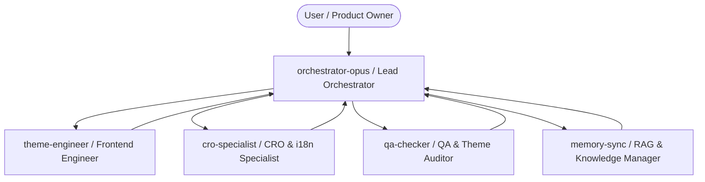

# Strukutur Tim AI Agent Otonom — shop.zyekh.com-theme

Dokumen Spesifikasi Arsitektur Tim Multi-Agent Otonom untuk Eksekusi Pengembangan Theme Shopify `shop.zyekh.com`.

---

## 1. Topologi & Workflow Tim Multi-Agent

---

## 2. Rincian Peran & Tanggung Jawab Subagent

| Subagent Name | Model Tier | Deskripsi & Tanggung Jawab Utama |
|---------------|------------|----------------------------------|
| **`orchestrator-opus`** | `pro` / Opus | **Lead Orchestrator**: Membreakdown instruksi user/PRD, membagikan tugas ke subagent spesialis, me-review kualitas output (*Doubt-Driven Review*), dan menyetujui integrasi akhir. |
| **`theme-engineer`** | `pro` / `flash` | **Shopify Theme Engineer**: Membangun Liquid 2.0 sections/snippets, mengelola token CSS variables (`css-variables.liquid`), layout Bento Grid, dan Vanilla ES6+ JS (zero 3rd-party lib). |
| **`cro-specialist`** | `pro` / `flash` | **CRO & Localization Specialist**: Mengembangkan fitur pendorong konversi (Sliding AJAX Cart Drawer, Free Shipping Bar, Sticky ATC, Escrow Badges) & sinkronisasi terjemahan `en.default.json` / `id.json`. |
| **`qa-checker`** | `flash` | **QA & Accessibility Auditor**: Validasi syntax via `shopify theme check`, audit WCAG 2.1 AA (ARIA, focus-trap, kontras 4.5:1), Anti-FOUC, dan kepatuhan Zero-Emoji Rule. |
| **`memory-sync`** | `flash_lite` | **Knowledge & RAG Sync Manager**: Pencatatan log sesi ke Obsidian Vault (`00-AGY-Memory`), pembaruan checklist `PRD.md`, `DEVELOPMENT.md`, `CHANGELOG.md`, & `git commit` lokal. |

---

## 3. Protokol Eksekusi Otonom

1. **Mandate Driven by PRD**: Tim bekerja secara mandiri berdasarkan checklist backlog di [`PRD.md`](file:///home/fuckadmin/Projects/shop.zyekh.com-theme/PRD.md#L105).
2. **Strict ZYEKH Engine Enforcement**:
   - 0% Tailwind, 0% jQuery, 0% Swiper. 100% Vanilla JS & CSS Variables.
   - Light mode default + Dark mode via `[data-theme="dark"]`.
   - Zero hardcoded hex colors & Zero inline `<style>`.
   - Zero Emoji dalam kode, dokumen, maupun antarmuka UI.
3. **Checkpoints & Git Safety**:
   - Subagent diizinkan membuat `git commit` lokal untuk save progress.
   - Subagent **DILARANG KERAS** mengeksekusi `git push` ke remote origin tanpa instruksi eksplisit user.

---
*Struktur tim ini telah terdaftar secara aktif pada sistem AGY dan siap dieksekusi secara otomatis.*
